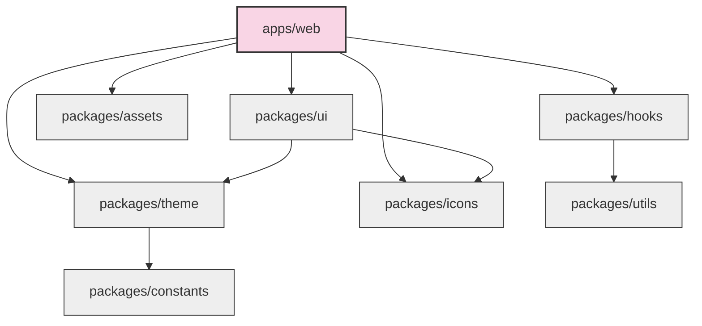

# Package Ownership & Modularity Rules

This document formalizes the architectural boundaries, dependency flows, and responsibilities for all packages and applications within the PragyaOS monorepo.

---

## 1. Monorepo Package Matrix & Metadata

Every workspace package must explicitly define its ownership, purpose, allowed/forbidden imports, public APIs, and consumers.

### `@pragyaos/theme`
*   **Purpose**: Single source of truth for **every visual decision** across PragyaOS.
*   **Allowed Imports**: Static configuration objects (no runtime dependencies).
*   **Forbidden Imports**: `@pragyaos/ui`, `@pragyaos/icons`, `apps/*`.
*   **Public API**: Design Tokens (Colors, Typography, Spacing, Sizing, Radius, Grid, Containers, Motion, Elevation, Opacity, Blur, Breakpoints, Interaction States, Focus States, Layering), Tailwind Preset (`pragyaPreset`), CSS Custom Variables Generator.
*   **Ownership**: Infrastructure / Design System Team.
*   **Consumers**: `packages/ui`, `apps/web`.

### `@pragyaos/ui`
*   **Purpose**: Shared stateless design system primitives.
*   **Allowed Imports**: `@pragyaos/theme`, `@pragyaos/icons`, headless Radix primitives.
*   **Forbidden Imports**: `apps/web`, `apps/api`, helper packages containing domain business logic.
*   **Public API**: Atomic components (Button, Input, Badge, base Card, Modal, Tooltip, Popover, Dialog, Tabs, Accordion).
*   **Ownership**: Infrastructure Team.
*   **Consumers**: `apps/web`.

### `@pragyaos/icons`
*   **Purpose**: React SVG component wrappers.
*   **Allowed Imports**: Core React.
*   **Forbidden Imports**: All other packages.
*   **Public API**: Unified SVG wrappers (`SearchIcon`, `BookIcon`, `MenuIcon`, etc.).
*   **Ownership**: Infrastructure Team.
*   **Consumers**: `packages/ui`, `apps/web`.

### `@pragyaos/assets`
*   **Purpose**: Editorial illustrations and static doodles/vector strokes.
*   **Allowed Imports**: Core React.
*   **Forbidden Imports**: All other packages.
*   **Public API**: Editorial vector assets (`CornerDoodles`, `EmptyNoCourses`, etc.).
*   **Ownership**: Infrastructure / Design Team.
*   **Consumers**: `apps/web`.

### `@pragyaos/hooks`
*   **Purpose**: Reusable low-level React interaction and DOM hooks.
*   **Allowed Imports**: Core React, `@pragyaos/utils`.
*   **Forbidden Imports**: Product code, API queries, or Redux store selectors.
*   **Public API**: Hooks (`useClickOutside`, `useWindowSize`, `useMediaQuery`).
*   **Ownership**: Shared Core Team.
*   **Consumers**: `apps/web`.

### `@pragyaos/utils`
*   **Purpose**: Pure ES utility functions.
*   **Allowed Imports**: None (pure JS/TS functions).
*   **Forbidden Imports**: React elements, hooks, window references.
*   **Public API**: Shared utility helpers (`cn`, `formatCurrency`).
*   **Ownership**: Shared Core Team.
*   **Consumers**: All applications and packages.

### `@pragyaos/constants`
*   **Purpose**: Unified static codes, validation messages, and system variables.
*   **Allowed Imports**: None.
*   **Forbidden Imports**: All other packages.
*   **Public API**: Enums and static objects (`HttpStatus`, `Messages`, `Regex`).
*   **Ownership**: Shared Core Team.
*   **Consumers**: All applications and packages.

### `@pragyaos/types`
*   **Purpose**: Shared typescript domain models.
*   **Allowed Imports**: None.
*   **Forbidden Imports**: Business actions or runtime modules.
*   **Public API**: Types (`User`, etc.).
*   **Ownership**: Backend/Frontend contract owners.
*   **Consumers**: All applications and packages.

---

## 2. Dependency Flow Vector

To prevent circular dependencies and compile-time issues, imports must flow strictly in a single direction:

---

## 3. Component Classification & Boundaries

To prevent `packages/ui` from being polluted with product-specific code, all components must fall into one of three classifications:

### 1. UI Primitives (`packages/ui`)
*   **Definition**: Fully stateless, generic components that can be used in any product context (e.g., student workspace vs. public blog). They wrap headless primitives (like Radix) and apply the PragyaOS design preset.
*   **Examples**:
    *   `Button`, `Input`, `Textarea`, `Checkbox`, `Select`
    *   `Card` (base frame only), `Dialog`, `Modal`, `Drawer`
    *   `Badge`, `Avatar`, `Tooltip`, `Popover`
    *   `Tabs`, `Accordion`, `DropdownMenu`
*   **Rules**:
    *   Must NOT import any API client, hook, or state from application code.
    *   Must NOT contain business logic or domain types.

### 2. Shared Composites (`apps/web` or shared product folder)
*   **Definition**: Mid-level structural UI blocks that coordinate primitives to satisfy common UI patterns but are not bound to a single feature.
*   **Examples**:
    *   `EmptyState` (using assets)
    *   `SearchBox` (with input + search icon)
    *   `FormField` (labels + input + validation error display)
    *   `Toolbar`, `CommandPalette` UI frame, `DataTableToolbar`
*   **Rules**:
    *   Can coordinate multiple primitives.
    *   Must remain stateless or rely purely on transient visual state.

### 3. Application Components (`apps/web` features/layouts)
*   **Definition**: High-level modules and pages that bind business logic, API queries, Redux selectors, forms, and product metadata.
*   **Examples**:
    *   `MarketingHeader`, `MarketingFooter`
    *   `HeroSection`, `PricingSection`, `NewsletterCTA`
    *   `CoursePreviewCard`, `PricingCard`, `TestimonialCard`
*   **Rules**:
    *   Can import API client hooks, select state from global stores, and contain domain business logic.

---

## 4. Package Rules Enforcement

1.  **Strict File Ownership**:
    *   Any changes inside `packages/*` require reviews from the Principal Architect.
    *   Feature files inside `apps/web/src/features/*` are owned by domain teams.
2.  **Lint Guardrails**:
    *   Import boundary rules must be verified via ESLint configuration (`eslint-plugin-import` limits).
