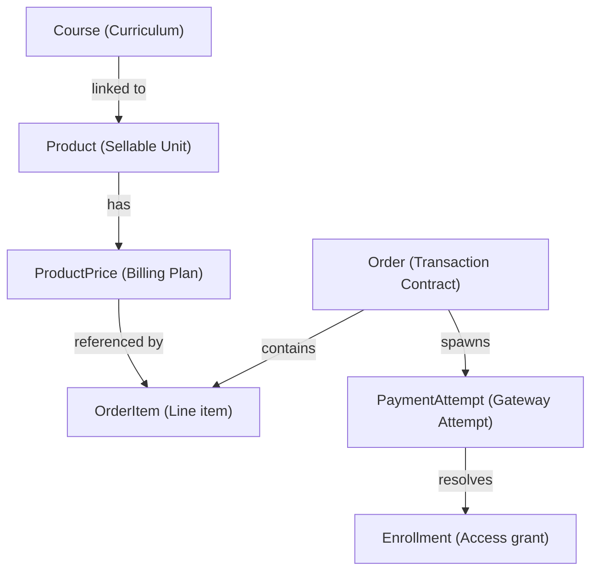
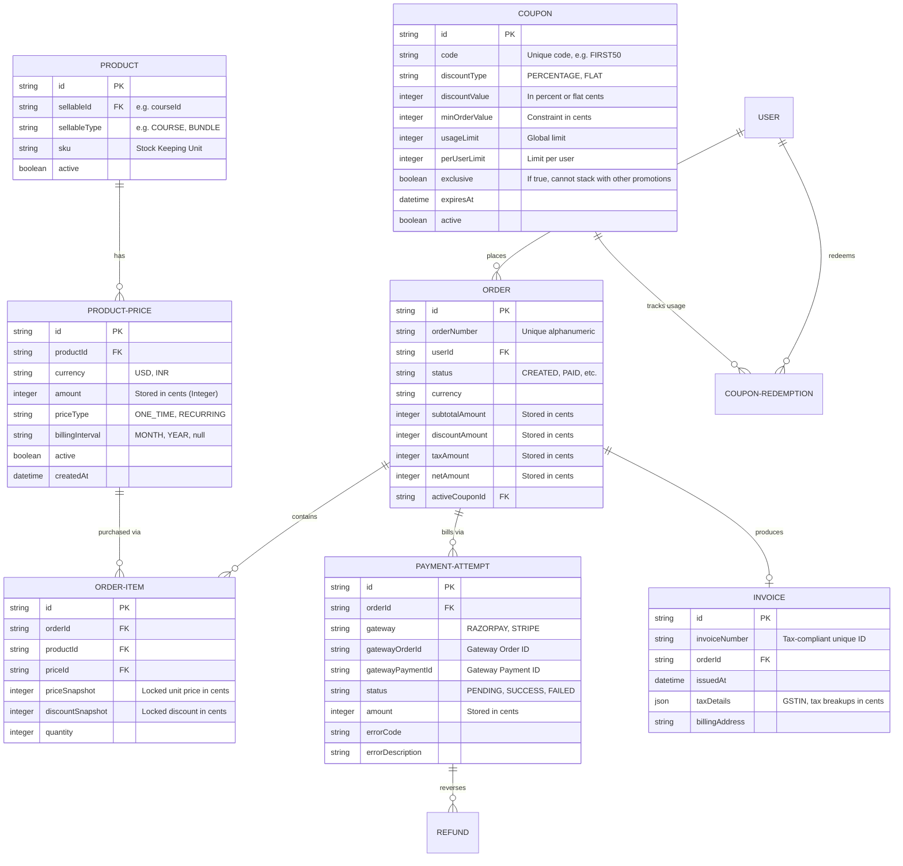
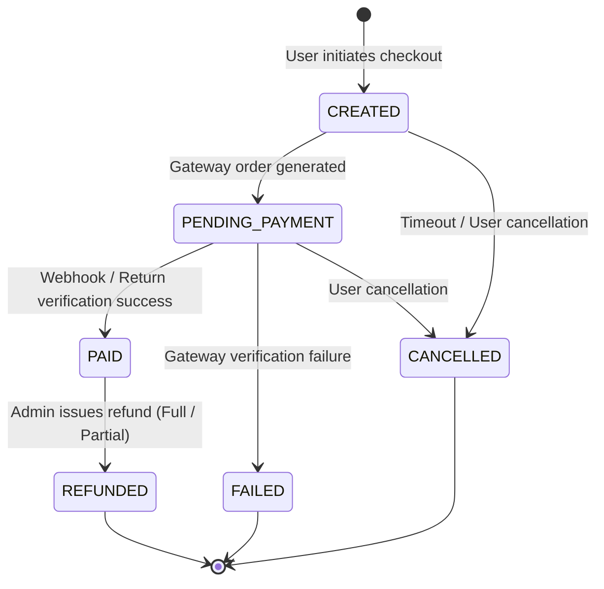

# PragyaOS: Commerce Platform Architectural Design Spec

This document details the architectural and database design specifications for the PragyaOS **Commerce Platform**. It models a highly extensible, secure, and tax-ready system designed to support paid courses, discounts, and payment gateway integrations.

---

## 1. Domain Architecture & Product Separation

In PragyaOS, courses are never directly linked to orders. We implement a strict separation of concerns using the following hierarchy:



### Why this Separation is Beneficial:
1. **Generic Sellable Abstraction**: The checkout, coupon, invoice, and order processing code operates strictly on `Product` and `ProductPrice` abstractions. This means we can support future sellable items (like memberships, course bundles, coding labs, subscription plans, or physical certificates) without modifying a single line of checkout/billing logic.
2. **Flexible Pricing Plans**: A single `Product` (e.g., "Full-Stack Web Development Course") can have multiple active `ProductPrice` records (e.g., a one-time charge of ₹4,999, a monthly subscription of ₹999, or an international tier of $199).
3. **Curriculum Decoupling**: Instructors can edit courses, reorder modules, and update videos without impacting active catalogs, billing plans, or invoice audit histories.
4. **Access Grant Flexibility**: Once an order is marked `PAID`, the fulfillment worker resolves the product's underlying `sellableType` and grants the appropriate entitlement (e.g., creates a student enrollment for `COURSE` or extends access for `MEMBERSHIP`).

### 1.1 Money Value Object (Domain Core)
To prevent floating-point rounding errors and ensure consistent multi-currency math throughout the platform, all monetary amounts are wrapped in a **Money Value Object**:
- **Representation**: Encapsulated as:
  ```typescript
  export class Money {
    constructor(
      public readonly amount: number, // Represented in cents/paise (e.g., ₹49.99 = 4999) to avoid decimals
      public readonly currency: string // ISO 3-letter code (e.g., "INR", "USD")
    ) {}

    public add(other: Money): Money {
      this.assertSameCurrency(other);
      return new Money(this.amount + other.amount, this.currency);
    }

    public subtract(other: Money): Money {
      this.assertSameCurrency(other);
      return new Money(this.amount - other.amount, this.currency);
    }

    public multiply(factor: number): Money {
      return new Money(Math.round(this.amount * factor), this.currency);
    }

    private assertSameCurrency(other: Money): void {
      if (this.currency !== other.currency) {
        throw new Error("Currency mismatch during money arithmetic operation.");
      }
    }
  }
  ```

---

## 2. Entity Relationships & Domain Boundaries



### Price Immutability (Versioning):
To guarantee audit trails and financial reporting consistency:
- **`ProductPrice` records are strictly IMMUTABLE**. Once a price is created, its amount and currency must never be updated.
- If a price changes, mark the existing price record as `active = false` and insert a new active `ProductPrice` row. This preserves the historical price linkages of past `OrderItem` entities.

---

## 3. Order & Payment Lifecycle

Orders transition through a strict finite state machine (FSM). These transitions are monitored by database constraints and transactional state checks.



### Idempotency Protection:
- **Order Creation ID**: Checkout requests include an optional `idempotencyKey` stored in Redis (e.g. `idemp:order:${userId}:${cartHash}`) for 15 minutes to prevent duplicate orders if a user double-clicks submit.
- **State Transition Guard**: Updates to `PAID` utilize optimistic locking:
  ```sql
  UPDATE "Order" SET status = 'PAID' WHERE id = :orderId AND status = 'PENDING_PAYMENT'
  ```
  If another thread (e.g. webhook racing with client return redirect) already updated the order, this query updates 0 rows, preventing duplicate fulfillment.

---

## 4. Payment Gateway Abstraction Layer

To avoid tight coupling to Razorpay, all gateway operations are encapsulated behind a unified **`PaymentGateway`** adapter interface:

```typescript
export interface PaymentGatewayOrderResponse {
  gatewayOrderId: string;
  amount: number;
  currency: string;
  metadata?: Record<string, any>;
}

export interface PaymentGateway {
  name: string; // e.g. "RAZORPAY"
  
  // Creates order on gateway
  createOrder(orderNumber: string, amount: Money): Promise<PaymentGatewayOrderResponse>;
  
  // Verifies signature return checks
  verifyPayment(payload: {
    gatewayOrderId: string;
    gatewayPaymentId: string;
    gatewaySignature: string;
  }): Promise<boolean>;

  // Processes refunds through gateway
  processRefund(gatewayPaymentId: string, amount: Money, reason: string): Promise<string>;
}
```

This ensures we can register `RazorpayGateway` or `StripeGateway` providers transparently without rewriting the checkout business services.

### Checkout Flow
1. **Initiate**: Backend creates an `Order` in the `CREATED` state. It fetches prices directly from the database (preventing client-side price tampering).
2. **Register Gateway Order**: Spawns a `PaymentAttempt`, calls the injected `PaymentGateway.createOrder()` matching the exact order `netAmount` and `currency`. The `PaymentAttempt` updates to `PENDING_PAYMENT` storing the returned `gatewayOrderId`.
3. **Capture client payload**: On client payment completion, Razorpay/Stripe returns payment confirmations.
4. **Verify Signature**: Calls `PaymentGateway.verifyPayment()`.
5. **Fulfill**: If signature is valid, update `PaymentAttempt` to `SUCCESS`, mark `Order` as `PAID`, generate invoice, and dispatch asynchronous `FulfillmentJob` to BullMQ.

### Webhook Handling & Resiliency
- Webhooks must listen on a secure, unauthenticated endpoint (e.g. `/api/v1/commerce/webhooks/:gatewayName`).
- **Webhooks Verification**: Compute signature using webhook secret configured for the matching gateway.
- **Double Processing Protection**: Store processed `gatewayPaymentId` in Redis with a 24-hour TTL. If the payment key exists, respond with `200 OK` instantly and ignore the webhook.

---

## 5. Coupon Engine & Discount Validation Rules

Coupons can either offer a `PERCENTAGE` or a `FLAT` discount. 

### Constraints and Validations evaluated:
- **Expiration**: Check `expiresAt >= NOW()`.
- **Global Limits**: Verify `redemptionsCount < usageLimit`.
- **Per-User Limits**: Count existing `CouponRedemption` entries where `userId = currentUserId` and `couponId = couponId` and verify they are less than `perUserLimit`.
- **Min Order Value**: Validate `subtotalAmount >= minOrderValue`.
- **Exclusivity check**: If the coupon is marked `exclusive`, checkout blocks apply if other promotion identifiers exist on the order.
- **Scope Constraints**:
  - `Product Scope`: Optional list of allowed product IDs. If empty, the coupon is site-wide.
  - `Category Scope`: Optional list of allowed category IDs.

### Calculations:
- **Percentage Discount**:
  $$\text{discount} = \min\left(\text{subtotal} \times \frac{\text{percentage}}{100}, \text{maxDiscountLimit}\right)$$
- **Flat Discount**:
  $$\text{discount} = \min(\text{flatAmount}, \text{subtotal})$$

---

## 6. Invoice, Refunds, & Taxation Engine

### Taxation Engine Abstraction
To keep GST, VAT, and country-specific tax logic separated from checkout calculations, we declare a dedicated **`TaxEngine`** interface:

```typescript
export interface TaxCalculationResult {
  taxableAmount: Money;
  totalTax: Money;
  taxRatesApplied: { label: string; rate: number; amount: Money }[]; // e.g. { label: "CGST", rate: 0.09, amount: Money }
}

export interface TaxEngine {
  calculateTax(amount: Money, billingRegion: string): Promise<TaxCalculationResult>;
}
```

### Invoices:
- Invoices are created immediately when an order status shifts to `PAID`.
- **Unique Format**: Sequential numbers structured as: `INV-YYYYMMDD-[seq]` managed by database sequences or isolated atomic counter fields.
- **GST & Tax Ready**: Invokes `TaxEngine.calculateTax()`, creating breakdowns of CGST, SGST, IGST, or local VAT.
- Captured address and tax snapshot fields are immutable to guarantee billing integrity.

### Refunds:
- Support for both `FULL` and `PARTIAL` reversals.
- **Gateway Sync**: Calls `PaymentGateway.processRefund()`.
- **Fractions Validation**: Verifies that total refunded amount does not exceed the order's original `netAmount`.
- **Audit Trails**: Logs all refunds in `Refund` schema capturing admin userId, refund reason, status (`PENDING`, `SUCCESS`, `FAILED`), and gateway reference ID.

---

## 7. Domain Events & Queue Actions

All checkout and billing actions dispatch domain events. Critical fulfillments (like course access grants) are handled by BullMQ workers to prevent client-facing HTTP timeouts.

### Domain Events:
- `OrderCreated`: Enqueues notification reminder jobs.
- `PaymentSucceeded`: Dispatches fulfillment worker to grant enrollment access.
- `PaymentFailed`: Triggers recovery emails (cart abandonment flow).
- `RefundIssued`: Initiates revocation checks to suspend course access.
- `InvoiceGenerated`: Triggers worker to generate PDF and email attachment to user.

---

## 8. Security Controls & Safe Guards

| Attack Vector | Mitigation Strategy |
| :--- | :--- |
| **Price Tampering** | Client payloads specify only `priceId` and `couponCode`. Prices are queried from the database; calculations are executed entirely on the server. |
| **Race Conditions (Coupons)** | Use atomic increments or pessimistic transaction locks (`SELECT FOR UPDATE`) on the `Coupon` row during validation to avoid exceeding usage limits. |
| **Duplicate Payments** | Enforce a unique index constraint on `PaymentAttempt(gatewayPaymentId)`. This prevents creating multiple successful payments for a single gateway ID. |
| **Webhook Spoofing** | Validate gateway signature headers using the local secret. Rejects payloads that do not compute matching HMAC checksums. |
| **Replay Attacks** | Reject webhook events with timestamps older than 5 minutes. |

---

## 9. Performance & Index Optimizations

- **Indices**:
  - `CREATE UNIQUE INDEX idx_order_number ON "Order"(order_number);`
  - `CREATE INDEX idx_payment_attempt_gateway ON "PaymentAttempt"(gateway_order_id);`
  - `CREATE UNIQUE INDEX idx_invoice_number ON "Invoice"(invoice_number);`
- **Caching**:
  - Cache valid catalog products and active prices in Redis.
  - Active coupons cached with a short TTL (e.g. 5 minutes) to speed up checkout validation.
- **Database Scaling**:
  - Offload PDF rendering to async workers via BullMQ. The REST endpoint returns a signed URL pointing to the PDF asset stored on Cloudflare R2.

---

## 10. Suggested Implementation Roadmap

1. **Database Modeling**: Add Product, ProductPrice, Order, OrderItem, Coupon, CouponRedemption, PaymentAttempt, Invoice, and Refund tables to Prisma schema. Run migrations.
2. **Repositories Layer**: Implement `ProductRepository`, `OrderRepository`, and `CouponRepository`.
3. **Money & Tax Interfaces**: Set up the `Money` value object and the `TaxEngine` interface.
4. **Checkout Service & FSM**: Build the `CheckoutService` that manages order creation, state transitions, and validation rules.
5. **Gateway Adapter (Razorpay)**: Implement the `PaymentGateway` interface for Razorpay.
6. **Webhooks Router**: Expose the webhook endpoints, implementing BullMQ event dispatch pipelines for asynchronous fulfillments.
7. **Invoicing & PDF generation**: Setup BullMQ workers to compile, sign, and store PDF invoices on Cloudflare R2.
8. **Integration Tests**: Write unit/integration tests validating calculations, coupon scope limits, signature matchers, and RBAC rules.
