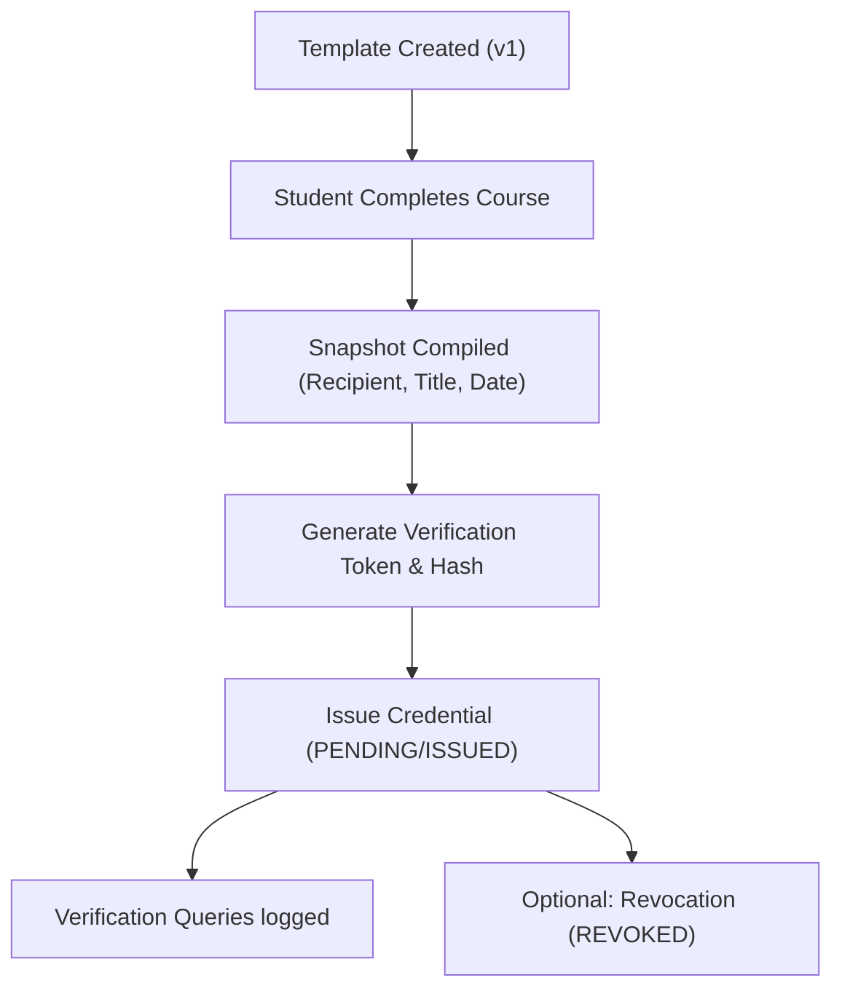

# Identity & Credential Platform Lifecycle

This document describes the complete lifecycle of template creation, issuance, verification, and revocation inside PragyaOS.

## Lifecycle States

### 1. Template Design & Versioning
* Administrators create templates using HTML/CSS styles and brand assets (`CredentialTemplate`).
* Once a template issues a credential, the template layout becomes locked. If a change is needed, a new record is created with an incremented `templateVersion` (e.g. `v2`).

### 2. Completion & Trigger
* When a student finishes all learning units in a course, the system publishes a completion event.
* The Identity & Credential Service receives this completion event and starts the issuance sequence.

### 3. Snapshot Compilation
* The system fetches current profiles and snapshots the context into the credential record:
  * Student first/last names.
  * Course titles.
  * Primary instructor signatures.
  * Issuance dates.
* This metadata ensures historic integrity remains static even if records are updated or deleted later.

### 4. Token & Hash Generation
* The system generates a cryptographically secure random token.
* A SHA-256 hash is computed and saved inside the database (`verificationHash`).
* The raw token is returned to the user in verification URLs and is not persisted.

### 5. Independent Verification Queries
* Visitors query verification routes passing the raw token.
* The system hashes the token and searches for a matching `verificationHash`.
* The system saves a log record inside the database (`CredentialVerification`) containing the request IP address, client user agent, query timestamp, and success status.

### 6. Revocation
* Authorized administrators can invalidate credentials (e.g., in cases of academic dishonesty or refund chargebacks).
* The credential status updates to `REVOKED` and details are logged inside `CredentialRevocation`.
