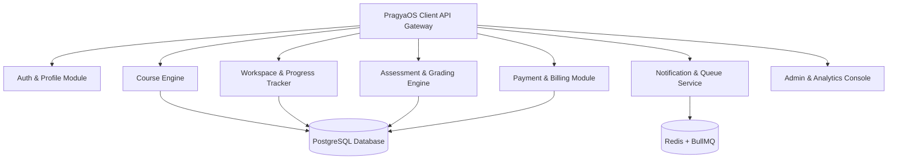
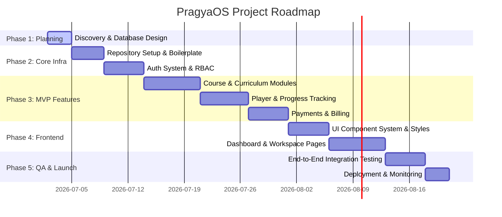

# PragyaOS: Product Discovery & Architectural Blueprint

**Product Name:** PragyaOS  
**Tagline:** *The Operating System for Modern Learning*  
**Author:** Antigravity (SaaS Architecture & Product Discovery Team)  
**Status:** Under Review (Feedback Requested)

---

## 1. Product Vision
PragyaOS is designed to transcend the limitations of traditional Learning Management Systems (LMS) and generic course marketplaces. Instead of a passive repository of video links and text documents, PragyaOS is envisioned as a **Modern Learning Experience Platform (LXP)**. 

It functions as an interactive, adaptive ecosystem that treats learning as a dynamic, continuous workflow. By blending curated learning paths, collaborative communities, multi-tenant organization partitions, immersive content players, and intelligent co-pilots, PragyaOS becomes the operational layer for skill acquisition and knowledge management in both educational and corporate environments.

---

## 2. Mission Statement
> "To empower students, instructors, and organizations with a seamless, highly engaging, and secure digital environment that transforms learning from a transactional activity into an interactive, portfolio-building experience."

---

## 3. Product Goals
*   **Engineering Excellence:** Deliver a production-grade system with a clean, modular structure, strict type safety, robust security patterns, and clear observability.
*   **Exceptional User Experience:** Establish a visual standard inspired by modern SaaS tools (e.g., Linear, Vercel, Stripe) utilizing deep gradients, curated typography, glassmorphism, responsive micro-animations, and full accessibility.
*   **Scale and Performance:** Architect the platform to easily support tens of thousands of concurrent learners, with low-latency page loads and highly optimized database querying.
*   **Multi-Tenant Ready:** Lay a robust foundation for organizations to manage custom portals, custom domains, and localized branding.
*   **Enterprise-Grade Security:** Enforce strict Role-Based Access Control (RBAC), end-to-end data encryption, audit trails, and comprehensive rate limiting to prevent abuse.

---

## 4. User Personas

### Persona A: Alex Chen (The Career Switcher / Student)
*   **Background:** 26-year-old Associate Product Manager transitioning to Full-Stack Engineering.
*   **Needs:** Guided, structured learning paths, proof of skill acquisition (verifiable projects/certificates), mobile-first accessibility, and peer feedback.
*   **Pain Points:** Traditional courses lack interactivity; video-only content is passive; certificates lack credibility in the job market.

### Persona B: Sarah Jenkins (The Industry Expert / Instructor)
*   **Background:** Senior Staff Engineer at a tech company who wants to teach advanced system design.
*   **Needs:** Easy-to-use content ingestion, rich analytics showing student drop-off points, flexible pricing/cohort management tools, and collaborative communication channels with students.
*   **Pain Points:** LMS interfaces are clunky and feel like 2012 software; uploading and organizing materials is manual; grading assignments is tedious.

### Persona C: Marcus Sterling (The Enterprise Training Admin)
*   **Background:** L&D Director at a mid-sized enterprise (500+ employees) using PragyaOS to upskill employees.
*   **Needs:** Multi-tenant isolation, bulk user provisioning (SSO/SCIM), audit trails, custom branding, and compliance reporting.
*   **Pain Points:** Standard LMS tools cannot separate team progress cleanly, nor do they support flexible organization-level permissions.

---

## 5. User Roles and RBAC Matrix
The system defines five core roles. The RBAC model secures all API endpoints, database operations, and frontend routes.

| Role | Description | Access Rights / Allowed Operations |
| :--- | :--- | :--- |
| **Visitor** | Anonymous web user. | Browse landing pages, view the public course catalog, read blogs/docs, sign up. |
| **Student** | Active learner. | Enroll in courses (free/paid), access course players, complete quizzes/assignments, track progress, participate in community boards, download earned certificates. |
| **Instructor** | Content creator. | Create/edit courses, manage curriculum chapters, upload assets, set pricing, view dashboard analytics for owned courses, grade student assignments, answer community threads. |
| **Admin** | Organization/Platform admin. | Manage users, approve/reject courses, manage payments/refunds, moderate community boards, view platform-wide analytics, customize organization branding. |
| **Super Admin** | Platform owner/System operator. | Full root-level permissions. Access system health metrics, manage system configurations, provision organization accounts, delete spam/malicious accounts. |

---

## 6. Major Modules



### I. Auth & Identity Module
*   Secure signup/login, multi-factor authentication (MFA), password reset workflows.
*   JWT token issuance with short-lived access tokens (15m) and long-lived, secure, HTTP-only refresh tokens (7d) with rotation.
*   Role validation middleware matching user identities to permissions.

### II. Course Engine
*   **Course Builder:** A drag-and-drop curriculum organizer for instructors supporting text, videos, downloadable assets, and external links.
*   **Player Interface:** Distraction-free video player with speed controls, picture-in-picture, bookmarks, notes, and progress persistence.
*   **Catalog & Search:** Semantic search and tag filtering powered by PostgreSQL index optimizations.

### III. Workspace & Progress Tracker
*   **Student Dashboard:** Unified view of active courses, recent activities, upcoming deadlines, and custom daily/weekly streaks.
*   **Instructor Center:** Course performance metrics, revenue tracking, review management, and active student cohorts.

### IV. Assessment & Certification Engine
*   **Quiz Runner:** Support for multiple-choice, true/false, fill-in-the-blank, and code-snippet questions with anti-cheat timers.
*   **Certificates:** Automatic generation of high-quality PDF certificates on completion, complete with unique cryptographic verification hash.

### V. Payment & Billing Module
*   Secure checkout via Razorpay (supporting UPI, cards, net banking).
*   Automatic invoice generation and refund orchestration.
*   Instructor payouts ledger tracking revenue splits (e.g., 70% instructor, 30% platform).

### VI. Notification & Queue Service
*   Asynchronous event processing using Redis and BullMQ.
*   Multi-channel notifications: email (resend/sendgrid), in-app push, and system reminders.

---

## 7. MVP Scope
The MVP will focus on delivering a high-quality end-to-end learning flow.

*   **Authentication:** Local signup/login (email/password) + session persistence.
*   **Core LXP Flow:**
    *   Instructors can create a course, design curriculum modules, upload lessons (video/text), and set a price.
    *   Students can browse the catalog, view a detailed course landing page, and complete checkout.
    *   Students can access the interactive course player, watch videos, submit text-based assignments, and view their progression dashboard.
*   **Basic Assessments:** MCQ quizzes at the end of each module.
*   **Branding & Styling:** A breathtaking landing page with fully cohesive dark/light modes, premium typography, and dynamic animations.

---

## 8. Future Scope
*   **Multi-Tenancy (Organizations):** Subdomains (e.g., `acme.pragyaos.com`) with isolated data, custom branding, and custom SSO (OIDC/SAML).
*   **AI Study Companion:** AI-generated quizzes, summary generators for video scripts, and personalized learning path recommendations.
*   **Community Forums:** Real-time chat channels, thread-based discussion boards, and markdown-enabled peer review systems.
*   **Live Cohorts:** Zoom/Tencent Meeting API integration, calendar scheduling, and group assignments.
*   **Mobile App:** Dedicated React Native application sharing the Core API layer.

---

## 9. Functional Requirements

### Student Requirements (FR-STU)
*   **FR-STU-01:** Students must be able to view their course progress as a percentage value.
*   **FR-STU-02:** Students must be able to download receipts and certificates in PDF format.
*   **FR-STU-03:** Students must be able to toggle lesson bookmarks and append personal notes to specific video timestamps.
*   **FR-STU-04:** Students must receive email alerts when a course instructor posts a new announcement.

### Instructor Requirements (FR-INS)
*   **FR-INS-01:** Instructors must be able to upload video materials up to 500MB (transcoded asynchronously).
*   **FR-INS-02:** Instructors must be able to define drafts, publish, or archive states for courses.
*   **FR-INS-03:** Instructors must be able to review, comment on, and grade student submissions.
*   **FR-INS-04:** Instructors must be able to export financial reports in CSV/Excel formats.

### Admin Requirements (FR-ADM)
*   **FR-ADM-01:** Admins must approve all courses before they are displayed in the public marketplace.
*   **FR-ADM-02:** Admins must be able to ban users or hide comments violating terms of service.
*   **FR-ADM-03:** Admins must be able to trigger refunds for students within the allowed refund window (14 days).

---

## 10. Non-Functional Requirements

### Performance & Scalability (NFR-PERF)
*   **NFR-PERF-01:** The landing page and dashboard must load in under 1.5 seconds under typical 3G connection constraints.
*   **NFR-PERF-02:** API endpoints must maintain a sub-200ms latency for read operations under 1000 concurrent requests/sec.
*   **NFR-PERF-03:** Database writes must utilize indexing, connection pooling, and optimized caching (Redis) for hot paths.

### Availability & Reliability (NFR-REL)
*   **NFR-REL-01:** The system target uptime is 99.9% excluding planned maintenance windows.
*   **NFR-REL-02:** Background processing tasks (video transcoding, email queues) must execute asynchronously and retry up to 3 times on failure.
*   **NFR-REL-03:** Database backups must run daily and be replicated to a multi-region block storage bucket.

### Security & Compliance (NFR-SEC)
*   **NFR-SEC-01:** All passwords must be stored using bcrypt with a salt round of 10.
*   **NFR-SEC-02:** Strict CORS policies, Helmet header configurations, and CSRF protection must be active on all server requests.
*   **NFR-SEC-03:** Data-in-transit must be encrypted using TLS 1.3, and data-at-rest must use AES-256 block encryption.

### Accessibility (NFR-A11Y)
*   **NFR-A11Y-01:** The frontend interface must adhere to WCAG 2.1 Level AA standards, ensuring complete keyboard navigation compatibility and screen reader support.

---

## 11. Risks and Mitigations

| Risk | Impact | Likelihood | Mitigation Strategy |
| :--- | :--- | :--- | :--- |
| **High Video Bandwidth Costs** | High | Medium | Use Cloudinary/AWS S3 for video staging. Transcode videos to HLS format with variable bitrates (Adaptive Bitrate Streaming) to minimize bandwidth. Use a CDN (e.g., Cloudflare) for edge caching. |
| **Payment Gateway Downtime** | Medium | Low | Design a resilient billing status machine. Implement webhook event listening with robust idempotency handling. Store checkout states in Redis. |
| **Database Performance Degradation** | High | Low | Use Prisma indexes on foreign keys, paginate all lists, cache frequently read catalog pages in Redis, and separate transactional reads from reporting logs. |
| **Spam / DDoS Attack Vectors** | High | Medium | Add rate limiters via `express-rate-limit` coupled with Redis token-bucket stores. Add Turnstile or reCAPTCHA on the signup flow. |

---

## 12. Technical Challenges
*   **Asynchronous Job Processing:** Transcoding high-definition videos, sending bulk newsletters, and compiling PDF certificates must not block the main Express server thread. This requires a robust task queue system (BullMQ) running on separate worker threads.
*   **State Hydration & Synchronization:** Managing offline course progress checkpoints and syncing them cleanly with the cloud database when the user regains network connectivity.
*   **Real-time Analytics Ingestion:** Tracking student watch time, video click rates, and mouse tracking to compute engagement scores without overwhelming PostgreSQL with high-frequency write operations. (Mitigated using batch commits).

---

## 13. Architecture Overview

```
                                  [ User / Browser ]
                                          │
                                    ( TLS 1.3/CDN )
                                          │
                                          ▼
                                   [ Reverse Proxy ]
                                          │
                  ┌───────────────────────┴───────────────────────┐
                  ▼                                               ▼
         [ Express Web Server ] <──────────────────────> [ Vite React SPA ]
                  │
        ┌─────────┴─────────┬──────────────────────┐
        ▼                   ▼                      ▼
  [ PostgreSQL ]     [ Redis Cache ]       [ BullMQ Worker ]
  (Prisma ORM)       (Session/Limiter)            │
                                                  ▼
                                            [ Cloud Services ]
                                            (Resend, Cloudinary, Razorpay)
```

The system uses a **Modular Monolith** architecture. This enables rapid developer iteration while maintaining a clear separation of concerns that allows modules to be refactored into microservices in the future.
*   **API Layer:** REST API mapping HTTP methods to specific controller functions. Validation is handled before controller execution using Zod schemas.
*   **Business Logic:** Domain-specific services containing the core platform capabilities (e.g., `CourseService`, `BillingService`).
*   **Database Access:** Database queries are executed via Prisma ORM for safety and migrations, and raw SQL queries are written for performance-critical aggregation paths.

---

## 14. Technology Justification

### Backend
*   **Node.js & Express:** Lightweight, highly performant for I/O operations, and supports a massive package ecosystem.
*   **PostgreSQL & Prisma:** Relational structure enforces strict data integrity. Prisma provides full type-safety and automated schema migrations.
*   **Redis & BullMQ:** In-memory speed for session state caching, rate limiting, and BullMQ task queues.
*   **Zod:** Runtime schema validation ensures no corrupt data penetrates database queries.

### Frontend
*   **React + Vite:** Lightning-fast HMR (Hot Module Replacement) and high-performance bundle builds.
*   **TypeScript:** Prevents runtime exceptions, enforces components contracts, and supports seamless refactoring.
*   **Redux Toolkit & TanStack Query:** RTK manages global client states (theme, auth state), while TanStack Query abstracts server-state fetching, caching, synchronization, and optimistic UI updates.
*   **Tailwind CSS & Framer Motion:** Tailwind accelerates responsive design using utility classes, while Framer Motion yields premium, hardware-accelerated animations.

---

## 15. Development Roadmap



---

## 16. Folder Structure Strategy
To maintain modularity, the codebase separates concerns using a monorepo-ready layout.

```
/pragyaos
├── /apps
│   ├── /api (Backend)
│   │   ├── /prisma (Migrations & schema)
│   │   ├── /src
│   │   │   ├── /config (Environment vars, databases, logger)
│   │   │   ├── /constants (HTTP statuses, constants)
│   │   │   ├── /controllers (Route handling wrappers)
│   │   │   ├── /middlewares (Auth, validation, error handler)
│   │   │   ├── /modules (Business modules)
│   │   │   │   ├── /auth
│   │   │   │   ├── /courses
│   │   │   │   └── /payments
│   │   │   ├── /routes (Express routing tables)
│   │   │   ├── /services (Domain execution scripts)
│   │   │   ├── /utils (Helper libraries)
│   │   │   └── app.ts (App configuration)
│   │   └── package.json
│   │
│   └── /web (Frontend)
│       ├── /public (Static assets)
│       ├── /src
│       │   ├── /assets (Images, custom svgs)
│       │   ├── /components (UI elements: buttons, modals, cards)
│       │   ├── /hooks (Custom React hooks)
│       │   ├── /layouts (Sidebar, dashboard, landing layouts)
│       │   ├── /pages (Routing destinations)
│       │   ├── /store (RTK state slices)
│       │   ├── /styles (Global variables, Tailwind rules)
│       │   ├── /types (Type definitions)
│       │   ├── /utils (Formatting, calculations)
│       │   └── main.tsx
│       └── package.json
```

---

## 17. Documentation Strategy
*   **API Specification:** Automatically generated OpenAPI/Swagger interactive dashboard hosted on `/api-docs` using `swagger-jsdoc` and `swagger-ui-express`.
*   **Architecture Decision Records (ADRs):** Stored under `/docs/adr/` capturing significant structural and architectural shifts with context, consequences, and decisions.
*   **Developer Onboarding Guide:** Clear `README.md` defining setup scripts, linting requirements, docker-compose instructions, and local database seeding steps.

---

## 18. UI Design Philosophy
The PragyaOS design rules prioritize a sleek, immersive, and premium UI:
1.  **Curated Colors:** Avoid default saturated colors. Use an elegant dark theme base (e.g., slate-950, deep indigo accents, and subtle borders `#1E293B`) combined with high-contrast text layers and subtle glowing shadows.
2.  **Typography Rules:** Use "Inter" as the primary font family and "Outfit" for display headers to invoke a modern tech feeling. Keep hierarchy clean.
3.  **Dynamic Micro-interactions:** Use scale transitions on buttons, skeleton screen loaders during component queries, and smooth panel expansions via Framer Motion.
4.  **Information Density:** Maintain balanced layout spacing (using `gap-6` or `padding-8`) to prevent cognitive overload.

---

## 19. Security Philosophy
PragyaOS operates on a zero-trust model internally:
*   **Sanitization & Validation:** Parse input parameters on the network boundary using Zod. Escape output content to prevent Cross-Site Scripting (XSS).
*   **Principle of Least Privilege:** Enforce multi-tier database access roles. The application backend uses credentials that restrict access to system maintenance schemas.
*   **Defensive Rate Limiting:** Enforce a tiered rate limiter:
    *   Auth route limits: Maximum of 5 requests/minute per IP address.
    *   Standard reads: 100 requests/minute per IP.
    *   File uploads: Restricted to authorized roles, with file size and type verified via magical signatures at the server level.

---

## 20. Success Criteria
*   **UX Rating:** System load speed is fast, accessibility is verified, and user flow transitions are smooth.
*   **Code Coverage:** Minimum of 85% test coverage across backend services and controllers (verified using Jest/Vitest).
*   **API Scalability:** Secure zero errors during load testing with 500 requests/second simulated via k6.
*   **Zero Leak Security:** Security scan tools (e.g., Snyk, npm audit) return zero critical vulnerabilities.
